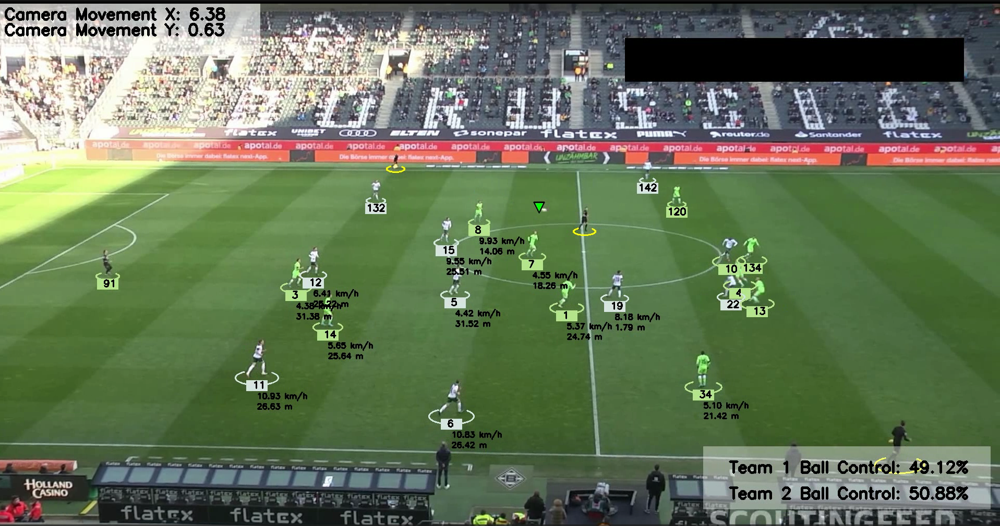

# Football Match Analysis

An end-to-end computer vision pipeline for analyzing football match footage. The system detects and tracks players, referees, and the ball, assigns players to teams, estimates player speed and distance covered, and calculates team ball possession.

The project was extended with additional player statistics, heatmap visualizations, and exploratory data analysis.

> **Note:** This project started from an existing open-source football analysis implementation as a hands-on exploration of how an end-to-end computer vision pipeline is structured. The original pipeline was extended with player statistics, heatmaps, and exploratory data analysis.

---

## Demo Output

The pipeline generates an annotated video containing:

- Player and referee tracking with persistent IDs
- Team-colored annotations around players
- Ball tracking
- Live ball possession percentage for each team
- Player speed in km/h
- Player distance covered in meters

### Annotated Video

### Annotated Video


---

## Pipeline Architecture

The system follows a sequential computer vision and analytics pipeline orchestrated by `main.py`.

```text
Input Video (.mp4)
      │
      ▼
┌────────────────────────────┐
│ 1. Detection & Tracking    │
│    YOLO + ByteTrack        │
│                            │
│ Detects players, referees, │
│ and the ball and assigns   │
│ persistent tracking IDs.  │
└────────────────────────────┘
      │
      ▼
┌────────────────────────────┐
│ 2. Camera Movement         │
│    Compensation            │
│                            │
│ Optical Flow estimates     │
│ camera movement and        │
│ compensates player        │
│ positions accordingly.    │
└────────────────────────────┘
      │
      ▼
┌────────────────────────────┐
│ 3. View Transformation     │
│    Pixel → Real World      │
│                            │
│ Perspective transformation │
│ maps image coordinates to  │
│ approximate pitch         │
│ coordinates (105m × 68m). │
└────────────────────────────┘
      │
      ▼
┌────────────────────────────┐
│ 4. Speed & Distance        │
│    Estimation              │
│                            │
│ Estimates player speed     │
│ (km/h) and cumulative      │
│ distance covered (m).      │
└────────────────────────────┘
      │
      ▼
┌────────────────────────────┐
│ 5. Team Assignment         │
│    K-Means Clustering      │
│                            │
│ Uses jersey-color          │
│ clustering to assign       │
│ players to Team 1 or       │
│ Team 2.                    │
└────────────────────────────┘
      │
      ▼
┌────────────────────────────┐
│ 6. Ball Possession         │
│    Player Assignment       │
│                            │
│ Assigns the ball to the   │
│ closest tracked player    │
│ based on spatial proximity.│
└────────────────────────────┘
      │
      ▼
┌──────────────────────────────────────┐
│ 7. Analytics & Output                │
│                                      │
│ ├─ Annotated video                   │
│ ├─ Player statistics CSV  [Added]    │
│ ├─ Player heatmaps        [Added]    │
│ └─ EDA notebook           [Added]    │
└──────────────────────────────────────┘
```

---

## Features

### Original Pipeline

The base pipeline provides:

- Player, referee, and ball detection
- Multi-object tracking with persistent IDs
- Team assignment using jersey-color clustering
- Camera movement estimation using Optical Flow
- Perspective transformation
- Player speed estimation
- Player distance estimation
- Team ball possession estimation
- Annotated output video

### Extensions Added

The original implementation produced an annotated output video. I extended the pipeline with the following analytics features.

### 1. Player Statistics Export

**File:** `stats/stats_exporter.py`

Aggregates frame-level tracking information into per-player summary statistics and exports them to CSV.

Statistics include:

- Total distance covered (m)
- Average speed (km/h)
- Number of frames in ball possession

**Output:**

```text
output_videos/player_stats.csv
```

---

### 2. Player Heatmaps

**File:** `stats/heatmap_generator.py`

Generates positional density heatmaps using each player's transformed real-world position on the pitch.

Available visualizations:

- Individual player heatmap
- Combined heatmap for all players

**Outputs:**

```text
output_videos/heatmap.png
output_videos/heatmap_all_players.png
```

The heatmaps are generated using:

```python
matplotlib.pyplot.hist2d
```

### Example

_Add a generated heatmap screenshot here._

---

### 3. Exploratory Data Analysis

**File:** `analysis/football_eda.ipynb`

A lightweight Jupyter notebook that loads the exported player statistics and explores the resulting metrics.

The analysis focuses on:

- Player distance covered
- Average speed
- Ball possession
- Team-level comparisons
- Identifying notable player statistics

#### Example Findings

Based on the current **30-second sample video**:

- Team 2 averaged **27.81 m** per player compared with **19.47 m** for Team 1.
- Team 2 averaged **5.66 km/h** per player compared with **3.46 km/h** for Team 1.
- Player 91 recorded **146 possession frames**, substantially higher than the next highest player in the sample.

> These statistics are calculated from the 30-second sample and should not be interpreted as full-match statistics.

---

## Tech Stack

| Component | Technology |
|---|---|
| Object Detection | YOLO (Ultralytics) |
| Multi-Object Tracking | ByteTrack (`supervision`) |
| Team Classification | K-Means Clustering (`scikit-learn`) |
| Camera Motion Estimation | Optical Flow (OpenCV) |
| Perspective Transformation | OpenCV |
| Data Processing | pandas, NumPy |
| Visualization | Matplotlib, OpenCV |
| Analysis | Jupyter Notebook |

---

## Project Structure

```text
football_analysis/
│
├── main.py
│
├── trackers/
│   └── tracker.py
│
├── team_assigner/
│   └── team_assigner.py
│
├── camera_movement_estimator/
│
├── view_transformer/
│
├── speed_and_distance_estimator/
│
├── player_ball_assigner/
│
├── stats/                         # Added
│   ├── stats_exporter.py
│   └── heatmap_generator.py
│
├── analysis/                      # Added
│   └── football_eda.ipynb
│
├── utils/
│
├── models/
│   └── best.pt
│
├── input_videos/
│
├── output_videos/
│
└── stubs/
    └── Cached tracking results
```

---

## Setup

### 1. Clone the repository

```bash
git clone <your-repository-url>
cd football_analysis
```

### 2. Create a virtual environment

```bash
python -m venv .venv
```

Activate it on Windows:

```powershell
.venv\Scripts\activate
```

### 3. Install dependencies

```bash
pip install ultralytics supervision opencv-python pandas numpy matplotlib scikit-learn
```

### 4. Add the model

Place the trained YOLO weights at:

```text
models/best.pt
```

### 5. Add the input video

Place the source video inside:

```text
input_videos/
```

Update the video path in `main.py` if necessary.

---

## Usage

Run the pipeline with:

```bash
python main.py
```

Generated outputs are saved to:

```text
output_videos/
```

Including:

```text
output_video.avi
player_stats.csv
heatmap.png
heatmap_all_players.png
```

---

## Future Improvements

Potential extensions include:

- **Pass Accuracy Tracking** — estimate completed vs. failed passes based on ball-possession transitions.
- Automated text-based match summaries generated from player and team statistics.
- Team formation snapshot visualization.
- Interactive dashboard for exploring player statistics and heatmaps.

---

## Learning Outcomes

This project provided hands-on experience with:

- End-to-end computer vision pipeline design
- YOLO object detection
- Multi-object tracking
- Optical Flow
- Perspective transformation
- K-Means clustering
- OpenCV-based video processing
- Converting frame-level tracking data into structured analytics
- Data visualization and exploratory analysis

---

## Credits

The core computer vision pipeline was adapted from the football analysis project by Abdullah Tarek.

Original repository:
https://github.com/abdullahtarek/football_analysis

The original project provided the foundation for the detection, tracking, team assignment, camera movement estimation, perspective transformation, speed/distance estimation, and ball possession pipeline.

I extended the project with:
- Player statistics CSV export
- Player heatmap generation
- Exploratory data analysis notebook
